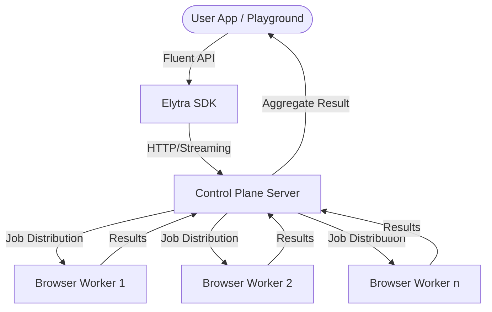
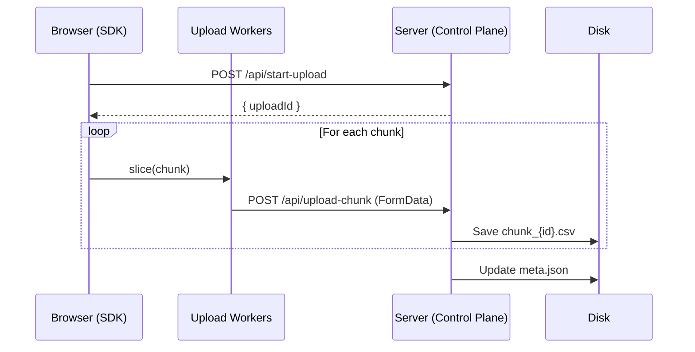
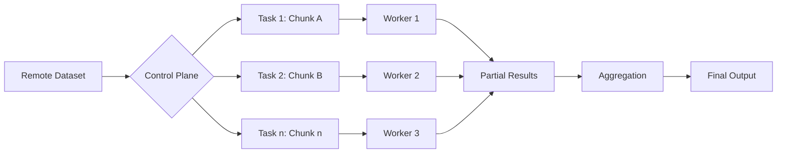

# 🦋 Elytra

**Elytra** is a high-performance, distributed data processing engine designed to handle massive datasets (GB-scale) by leveraging the power of browser-based parallelization. It allows developers to define complex data pipelines using a fluent TypeScript API and execute them across a network of browser workers.

---

## 🏗️ Architecture Overview

Elytra is composed of three primary components working in harmony:

1.  **SDK (Runtime)**: the client-side library used to define datasets and pipelines. It handles streaming uploads and job submission.
2.  **Control Plane (Server)**: An Express-based orchestrator that manages persistent datasets, job scheduling, and maintains real-time WebSocket connections with distributed workers.
3.  **Browser Workers**: Web Workers that perform the actual heavy lifting—either uploading data chunks in parallel or executing computation logic on data fragments.



---

## 📤 Data Upload & Storage

To handle massive files (like 4GB+ CSVs) without crashing the browser or server, Elytra uses a **Streaming Chunked Upload** strategy.

### The Upload Process:
1.  **Handshake**: The SDK requests an `uploadId` from the Control Plane.
2.  **Parallel Slicing**: The `StreamUploader` uses `File.slice()` to create 5MB–50MB chunks without loading the whole file into memory.
3.  **Worker Dispatch**: Chunks are handed off to dedicated **Upload Workers**.
4.  **Atomic Persistence**: The server receives chunks via Multer, writes them to `tmp_uploads`, and then performs an **atomic rename** to move them into the final `datasets/{uploadId}/shard_n/` directory.



---

## ⚡ Distributed Execution (`.distribute()`)

The core power of Elytra lies in its ability to split a massive job into tiny tasks that run in parallel.

### How it works:
1.  **Pipeline Definition**: Use `Elytra.remote(id).map().filter().count()`.
2.  **Job Submission**: When `.distribute()` is called, the SDK sends the operation list (serialized as strings) to the Control Plane.
3.  **Task Splitting**: The Control Plane identifies which shards/chunks belong to the dataset and creates a task list.
4.  **WebSocket Orchestration**: Tasks are pushed via WebSockets to all connected browser workers.
5.  **Compute**: Each worker executes the `compute.worker`, which parses its assigned CSV chunk, runs the operations, and sends back a partial result.
6.  **Aggregation**: The Control Plane merges partial results (e.g., summing counts or concatenating arrays) and returns the final answer to the user.



---

## 🚀 Key Features

-   **Fluent API**: `dataset().map().filter().reduce().distribute()`
-   **Zero Memory Bloat**: Uses streaming and file slicing for O(1) memory footprint during large uploads.
-   **Atomic Persistence**: Ensures storage efficiency and prevents corruption using atomic file operations.
-   **Auto-Cleanup**: Background tasks automatically prune old datasets to manage disk space.
-   **Browser-Powered**: Turn any browser tab into a compute node in your distributed network.

---

## 🛠️ Project Structure

```text
elytra/
├── apps/
│   ├── server/          # Control Plane (Express + WebSocket)
│   └── playground/      # Next.js UI for testing
└── packages/
    └── core/            # Eloytra SDK & Worker logic
```

---

## 🏁 Getting Started

1.  **Install dependencies**: `npm install`
2.  **Run in Dev mode**: `npm run dev`
3.  **Open Playground**: Navigate to `http://localhost:3000` to start uploading and processing data!