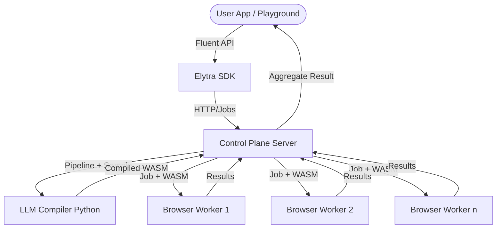

# 🦋 Elytra

**Elytra** is a high-performance, distributed data processing engine designed to handle massive datasets (GB-scale) by leveraging the power of browser-based parallelization. It allows developers to define complex data pipelines using a fluent TypeScript API and execute them across a network of browser workers.

---

## 🏗️ Architecture Overview

Elytra is composed of five primary components working in harmony:

1.  **SDK (Runtime)**: the client-side library used to define datasets and pipelines via a fluent API.
2.  **Control Plane (Node.js)**: An Express-based orchestrator that manages dataset registration (using DuckDB for partitioning), job scheduling, and WebSocket connections.
3.  **LLM Compiler (Python)**: A dynamic translation engine that converts JavaScript pipeline operations into SIMD-optimized Rust/WASM code on-the-fly.
4.  **Worker Node (Browser)**: The execution environment that runs in any browser tab, managing a pool of Web Workers to process data chunks.
5.  **Rust Core**: A set of high-performance base kernels used by the compiler and workers for heavy-duty computations.


```mermaid
graph TD
    User([User App / Playground]) -- Fluent API --> SDK[Elytra SDK]
    SDK -- HTTP/Jobs --> CP[Control Plane Server]
    CP -- Pipeline + Sample --> LLM[LLM Compiler Python]
    LLM -- Compiled WASM --> CP
    CP -- Job + WASM --> W1[Browser Worker 1]
    CP -- Job + WASM --> W2[Browser Worker 2]
    CP -- Job + WASM --> Wn[Browser Worker n]
    W1 & W2 & Wn -- Results --> CP
    CP -- Aggregate Result --> User
```

---

## ⚡ Distributed Execution & Job Distribution

The core power of Elytra lies in its ability to split a massive job into tiny tasks that run in parallel.

### Weighted Distribution Strategy
To balance performance across heterogeneous devices, Elytra uses a **4:1 weighted ratio** for large chunks (>500k rows):
*   **Desktop Workers**: Handle the majority of heavy workloads.
*   **Mobile Workers**: Assigned every 4th large chunk (if available) and prioritize smaller tasks.

### The Execution Flow:
1.  **Partitioning**: The Control Plane uses DuckDB to extract Row Group metadata from Parquet files.
2.  **Just-In-Time Compilation**: For custom pipelines, the Python server generates SIMD-optimized Rust and compiles it to WASM.
3.  **WebSocket Orchestration**: Tasks and WASM payloads are pushed to connected browser workers.
4.  **Aggregation**: The Control Plane merges partial results (summing counts, concatenating arrays, or merging variance partials).

---

## 🚀 Browser Execution Engine

Elytra's browser runtime is fine-tuned for high-performance and memory stability.

### Core Technologies:
*   **Parquet-WASM**: Efficiently reads Parquet row groups directly from R2/S3.
*   **Apache Arrow (IPC)**: Uses zero-copy transfers between the WASM engine and Web Workers.
*   **Global Locking**: Coordinates access to the single-threaded WASM engine to prevent memory corruption.

### Platform-Specific Optimizations:
| Feature | Desktop Worker | Mobile Worker |
| :--- | :--- | :--- |
| **Concurrency Cap** | `navigator.hardwareConcurrency` | Capped at `min(4, hwThreads)` |
| **Internal Worker Pool** | All hardware threads | Capped at **2 threads** for stability |
| **Memory Pressure** | Higher buffer tolerance | Strict **50k-row batching** to prevent OOM |
| **Internal Splitting** | Processes row group as unit | Further splits large row groups |

---

## 📤 Data Upload & Storage

To handle massive files (like 4GB+ CSVs), Elytra uses a **Streaming Chunked Upload** strategy.

### The Upload Process:
1.  **Parallel Slicing**: The SDK uses `File.slice()` to create chunks without loading the whole file into memory.
2.  **Worker Dispatch**: Chunks are handed off to dedicated **Upload Workers**.
3.  **Atomic Persistence**: The server receives chunks and performs an **atomic rename** into the final dataset shards.

---

## 🛠️ Project Structure

```text
elytra/
├── apps/
│   ├── server/          # Control Plane (Express + WebSocket + DuckDB)
│   ├── python-server/   # LLM Compiler (FastAPI + LangChain + wasm-pack)
│   ├── playground/      # Next.js UI for job orchestration
│   └── web/             # Browser Worker Page
├── packages/
│   ├── core/            # Elytra SDK, Executor & Worker logs
│   ├── rust-core/       # SIMD-optimized Rust kernels
│   └── ui/              # Shared UI components
```

---

## 🏁 Getting Started

1.  **Install dependencies**: `npm install`
2.  **Set Environment Variables**: Ensure `OPENAI_API_KEY` is set for the Python server.
3.  **Run in Dev mode**: `npm run dev`
4.  **Open Playground**: Navigate to `http://localhost:3000` to start processing!